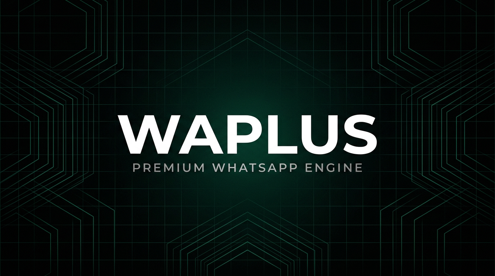
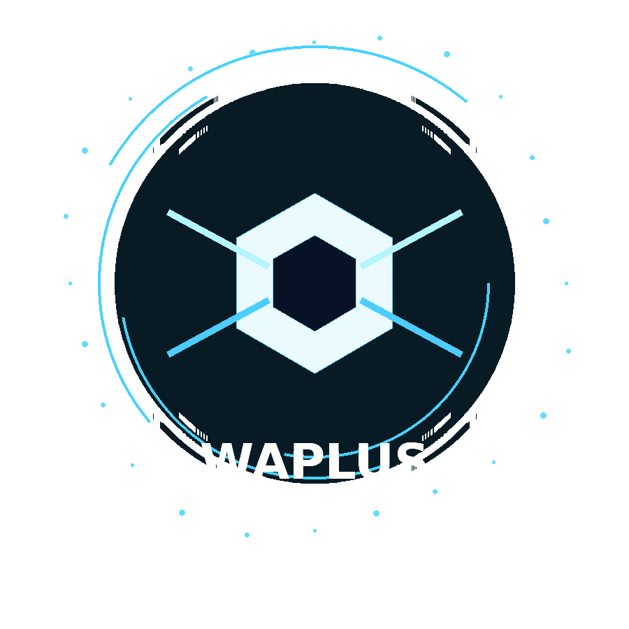

💜 WAPLUS AI

✨ The Intelligence Behind the WAPLUS Ecosystem ✨

More than a bot. A growing ecosystem for WhatsApp automation.

Bringing AI, message handling, and the WAPLUS community together — powered by the work and vision of Musteqeem.

 

  

 AI Integration   •   Five Handler Examples   •   Modular Architecture   •   Open Source Community

 <a href="#-the-waplus-ecosystem">🏗️ Ecosystem</a>   •  
<a href="#-five-message-handler-examples">⚡ Handler Examples</a>   •  
<a href="#-getting-started">🚀 Getting Started</a>   •  
<a href="#-still-part-of-the-waplus-community">💜 Community</a>

  

---

🚀 A New Chapter for WAPLUS AI

WAPLUS AI now introduces message-handler integration through five example commands, bringing the project one step closer to a more modular and extensible WhatsApp automation ecosystem.

This development represents an important step in the evolution of WAPLUS AI: connecting the original AI-focused project with a dedicated message-handler repository while preserving the relationship with the clean WAPLUS foundation.

But there's something important to understand.

WAPLUS AI has not abandoned its roots. It remains part of the WAPLUS community built around Musteqeem's work.

The repositories have different purposes, but they share a common direction: making WhatsApp bot development more understandable, reusable, and accessible to developers.

Whether you're here to experiment with AI, explore message handling, or build your own WhatsApp automation project, you're welcome.

💜 One community. Three repositories. More possibilities.

---

🧩 The WAPLUS Ecosystem

The WAPLUS ecosystem consists of three connected projects, each serving a distinct role.

flowchart TD
    A["💜 WAPLUS COMMUNITY Musteqeem"] --> B["🧠 WAPLUS AI AI-Integrated Project"]
    A --> C["🟢 WAPLUS Clean Starter Foundation"]
    B --> D["🔵 WAPLUS_HANDLER Dedicated Handler Project"]
    C -. "Foundation and inspiration" .-> D
    D -. "Reusable handler architecture" .-> B

    style A fill:#7C3AED,color:#fff,stroke:#6D28D9,stroke-width:2px
    style B fill:#2563EB,color:#fff,stroke:#1D4ED8,stroke-width:2px
    style C fill:#16A34A,color:#fff,stroke:#15803D,stroke-width:2px
    style D fill:#0891B2,color:#fff,stroke:#0E7490,stroke-width:2px

An overview of the intended project relationships. The arrows describe the ecosystem's direction and do not imply automatic synchronization between repositories.

 
1. 🧠 WAPLUS AI — The AI-Integrated Project

Repository: ""waplusdev/WAPLUS_AI"" (https://github.com/waplusdev/WAPLUS_AI)

This is the main AI-focused project and the starting point for developers who want to explore the WAPLUS AI experience.

It is the repository where AI functionality and the evolving bot architecture come together.

With the introduction of five message-handler example commands, WAPLUS AI demonstrates how message-handling functionality can fit into the broader project.

Think of it as the main experimental workspace.

2. 🟢 WAPLUS — The Clean Foundation

Repository: ""waplusdev/WAPLUS"" (https://github.com/waplusdev/WAPLUS)

WAPLUS is the clean, ready-to-use foundation without the dedicated message-handler implementation.

It provides a separate starting point for developers who want to explore the underlying project without beginning with the additional handler layer.

Keeping this foundation separate helps distinguish the core project from more specialized implementations.

Think of it as the starting point for a clean build.

3. 🔵 WAPLUS_HANDLER — The Dedicated Handler Project

Repository: ""waplusdev/WAPLUS_HANDLER"" (https://github.com/waplusdev/WAPLUS_HANDLER)

This is the dedicated repository for the WAPLUS message-handler project.

Its purpose is to give message-handling functionality a clear home where developers can study the implementation, experiment with event processing, and develop reusable handler patterns.

Rather than mixing every possible handler implementation into one project, a dedicated repository provides room for a more focused development experience.

Think of it as the handler-focused workspace.

«[!IMPORTANT]
The repository links identify the intended projects. Check each repository's current source code and README for its actual implementation, dependencies, and supported features.»

---

🎬 See How the Repositories Fit Together

The animation below illustrates the idea behind the WAPLUS ecosystem.

It starts with the AI project, moves to the clean foundation, and then highlights the dedicated handler repository.

flowchart LR
    A["01 WAPLUS_AI The Working Sketch"] --> B["02 WAPLUS The Clean Foundation"]
    B --> C["03 WAPLUS_HANDLER The Dedicated Handler"]

    style A fill:#7C3AED,color:#fff,stroke:#6D28D9,stroke-width:3px
    style B fill:#16A34A,color:#fff,stroke:#15803D,stroke-width:3px
    style C fill:#0891B2,color:#fff,stroke:#0E7490,stroke-width:3px

    linkStyle 0 stroke:#A78BFA,stroke-width:3px
    linkStyle 1 stroke:#22D3EE,stroke-width:3px

Stage| Repository| Role
01| ""WAPLUS_AI"" (https://github.com/waplusdev/WAPLUS_AI)| AI-focused development project
02| ""WAPLUS"" (https://github.com/waplusdev/WAPLUS)| Clean starter foundation
03| ""WAPLUS_HANDLER"" (https://github.com/waplusdev/WAPLUS_HANDLER)| Dedicated handler development

From the working project to the clean foundation, then to a dedicated handler workspace.

This is an architectural illustration, not a claim that one repository is automatically generated from another or that the repositories share synchronized code.

---

⚡ Five Message-Handler Examples

WAPLUS AI now introduces five example commands to demonstrate how a message-handler layer can be organized.

The examples below illustrate the kinds of functionality developers can explore. Their exact command names, syntax, and behavior should match the implementation available in the repository.

01. 💬 Message Information

Inspect the current message and its basic context.

.info

Purpose:

- Explore the incoming message context.
- Understand how message data reaches a handler.
- Create a foundation for message-aware features.

02. 🤖 AI Interaction

Explore how incoming commands can connect to AI functionality.

.ai Explain how message handlers work

Purpose:

- Demonstrate an AI-oriented command flow.
- Explore how user input is passed to a feature.
- Keep AI functionality separate from general message processing.

AI access depends on the configured provider, available credentials, and the implementation in the repository.

03. 👋 Welcome Messages

Explore automated responses to group participant events.

.welcome on

Purpose:

- Demonstrate a configurable welcome feature.
- Explore participant-related events.
- Separate group automation from ordinary command processing.

This example requires participant-event handling and a corresponding settings implementation.

04. 🔗 Anti-Link Moderation

Explore how a handler can inspect messages for unwanted links.

.antilink on

Purpose:

- Demonstrate message filtering.
- Explore group-level moderation settings.
- Show how handlers can apply rules before processing a message further.

Actual moderation behavior depends on the implementation, group permissions, and the bot's administrative privileges.

05. 🧰 Handler Status

Inspect the status of the handler or its available features.

.handler

Purpose:

- Provide an example of a handler-focused command.
- Offer a place to expose feature status or configuration.
- Help developers understand the handler's role in the overall application.

«[!NOTE]
The command examples above are illustrative. Confirm that the corresponding commands exist in the checked-out source before relying on them.»

Why Five Examples?

Because a message handler should be more than a collection of unrelated commands.

These examples represent five useful areas to explore:

Example| Development Concept
".info"| Message context
".ai"| AI integration
".welcome on"| Participant events
".antilink on"| Message filtering
".handler"| Handler management

Together, they provide a starting point for understanding how incoming messages, event processing, and feature-specific logic can fit into a modular bot architecture.

---

🏗️ Why a Dedicated Message Handler?

As WhatsApp bot projects grow, message processing can become difficult to maintain when every feature is placed in the same file.

A dedicated handler layer helps developers establish clearer boundaries between incoming events, command routing, and individual features.

A typical architecture might look like this:

flowchart TD
    A["📩 Incoming WhatsApp Event"] --> B["🔌 Connection Layer"]
    B --> C["⚙️ Message Handler"]
    C --> D["🔍 Inspect and Normalize Message"]
    D --> E{"Recognized Command?"}
    E -->|Yes| F["🧭 Command Router"]
    E -->|No| G["📨 Other Message Logic"]
    F --> H["🚀 Execute Feature"]
    G --> I["Handle or Ignore Event"]
    H --> J["✅ Send Response"]

    style A fill:#334155,color:#fff,stroke:#475569
    style C fill:#0891B2,color:#fff,stroke:#0E7490
    style F fill:#7C3AED,color:#fff,stroke:#6D28D9
    style H fill:#16A34A,color:#fff,stroke:#15803D

This diagram illustrates a possible design. The exact processing order depends on the implementation.

✨ Benefits of Separating Responsibilities

- Maintainability: Keep message processing separate from individual features.
- Reusability: Make it easier to reuse handler logic across compatible projects.
- Readability: Help new contributors understand where different responsibilities belong.
- Extensibility: Make room for additional message types and event-driven features.
- Testing: Enable developers to test message-processing logic independently where the architecture permits.

The goal is not to add complexity for its own sake. It is to make the code easier to understand and extend as the project evolves.

---

🛠️ Getting Started

📋 Requirements

Before running a WAPLUS project, check its repository documentation for the supported runtime, package manager, and setup requirements.

For the Node.js-based implementation described in the original WAPLUS AI documentation, you will generally need:

- Node.js 20 or a version supported by the project's dependencies.
- npm, normally included with Node.js.
- A WhatsApp account you control, if you intend to connect to WhatsApp.
- The project's required environment variables.
- Any API credentials required by the features you enable.

«[!TIP]
Check the repository's "package.json", lockfile, environment templates, and README before choosing a Node.js version or installing dependencies.»

🧠 Option A — Explore WAPLUS AI

Step 1: Clone the repository

git clone https://github.com/waplusdev/WAPLUS_AI.git
cd WAPLUS_AI

Step 2: Install dependencies

npm install

Step 3: Configure the environment

Configure the environment according to the files provided by the repository.

If ".env.example" exists, use it as the starting point:

cp .env.example .env

Edit ".env" with the values required by your implementation.

Never commit ".env" files containing secrets, session credentials, or API keys.

Step 4: Start the project

Use the startup command documented by the repository.

If "package.json" defines an "npm start" script, run:

npm start

🟢 Option B — Start with the Clean WAPLUS Foundation

Step 1: Clone the repository

git clone https://github.com/waplusdev/WAPLUS.git
cd WAPLUS

Step 2: Install dependencies

npm install

Step 3: Configure and launch

Configure the project according to its own README and environment template before launching it.

Use the startup script defined in its "package.json".

🔵 Option C — Explore WAPLUS_HANDLER

Step 1: Clone the repository

git clone https://github.com/waplusdev/WAPLUS_HANDLER.git
cd WAPLUS_HANDLER

Step 2: Install dependencies

npm install

Step 3: Review the implementation

Review the repository's package scripts and setup instructions before running the handler.

«[!WARNING]
These commands assume the repositories are publicly accessible and contain the expected Node.js project files. Installation and startup commands may differ between repositories. An empty or newly created handler repository will need its implementation added before it can run. Do not assume that "npm start" is available unless a corresponding script exists.»

---

🧑‍💻 Building Your Own Handler

A useful message handler begins with a clear understanding of the event it receives and the action it should perform.

When developing or extending a handler, consider the following principles.

1. Keep Responsibilities Clear

Separate connection management, message processing, command routing, and feature implementations where appropriate.

2. Validate Incoming Data

Messages and events may have missing fields or unexpected payloads. Handle them defensively.

3. Avoid Unintended Side Effects

A handler should not send repeated messages or perform moderation actions merely because an event was delivered more than once.

4. Respect Permissions

Group moderation features should check the relevant permissions and should only run when properly configured.

5. Test Before Deployment

Test message processing and event handling in a controlled environment before enabling automation in a real group.

6. Keep Secrets Private

Never commit API keys, WhatsApp session credentials, pairing codes, or other sensitive runtime data.

These principles help keep the handler understandable, testable, and safer to maintain.

---

💜 Still Part of the WAPLUS Community

WAPLUS AI is evolving, but its community connection remains part of the project's identity.

The work associated with Musteqeem and the WAPLUS community is an important part of this project's story.

Creating a separate handler repository does not mean abandoning the original project. It creates a place for a specific part of the architecture to develop independently while keeping the relationship between the projects visible.

We want developers to be able to explore the AI project, learn from the clean foundation, and experiment with message handling without losing sight of the broader ecosystem.

Whether you prefer a clean starting point or a more feature-focused project, there's a place for you here.

💜 Built Around an Idea. Growing Through the Community.

WAPLUS AI × WAPLUS × WAPLUS_HANDLER

 
---

🤝 Contributing

Contributions, bug reports, feature suggestions, and documentation improvements are welcome.

You can help by:

- Reporting reproducible bugs.
- Suggesting improvements to the handler architecture.
- Contributing example handlers and commands.
- Improving setup instructions.
- Testing changes in controlled environments.
- Helping new contributors understand the WAPLUS ecosystem.

Before contributing, review the contribution guidelines and license available in the relevant repository.

If you are proposing a change that affects more than one project, make it clear which repository should own the implementation.

---

🔐 Responsible Use

WAPLUS AI and its related projects are intended for legitimate development, experimentation, and consent-based automation.

WhatsApp connectivity through unofficial Web protocol libraries is subject to protocol changes, platform restrictions, and account risks.

Please:

- Use accounts and groups you are authorized to manage.
- Avoid unsolicited bulk messaging and spam.
- Respect privacy and obtain appropriate consent.
- Protect authentication sessions and API credentials.
- Test moderation features before enabling them.
- Review the applicable WhatsApp terms and the documentation and license of each dependency.

No project can guarantee uninterrupted access or immunity from account restrictions.

---

📚 Related Projects

Project| Description| Repository
🧠 WAPLUS AI| Main AI-focused project| "GitHub Repository" (https://github.com/waplusdev/WAPLUS_AI)
🟢 WAPLUS| Clean project foundation| "GitHub Repository" (https://github.com/waplusdev/WAPLUS)
🔵 WAPLUS_HANDLER| Dedicated message-handler project| "GitHub Repository" (https://github.com/waplusdev/WAPLUS_HANDLER)
🛠️ Musteqeem's Baileys Fork| WhatsApp Web protocol library referenced by the original project| "GitHub Repository" (https://github.com/musteqeem/baileys)
🟩 Node.js| JavaScript runtime| "Official Website" (https://nodejs.org/)

---

💜 WAPLUS AI

   

One ecosystem. Multiple starting points. A community that keeps building.

 Part of the WAPLUS community by Musteqeem.

 "WAPLUS AI" (https://github.com/waplusdev/WAPLUS_AI) ·
"WAPLUS" (https://github.com/waplusdev/WAPLUS) ·
"WAPLUS_HANDLER" (https://github.com/waplusdev/WAPLUS_HANDLER)

 Build responsibly. Keep it modular. Keep the community growing.

---

֎ GITHUB MANAGER — ORIGINAL PLUGIN ֎

---

«[!IMPORTANT]

💎 ֎ ORIGINAL GITHUB MANAGER PLUGIN — FOR SALE ֎»

╔══════════════════════════════════════════════════╗

║   ֎ GITHUB MANAGER — ORIGINAL PLUGIN ֎   ║

║   💎 FOR SALE: ₦5,000 NGN   ║

╚══════════════════════════════════════════════════╝

 🚀 Original| ⚡ Full Features| 💎 Clean UI
Original plugin| Full-featured version| Premium interface

No Watermark • Premium UI

 
---

🛠️ TEMPORARY ALTERNATIVES — USE FOR NOW

Option| Link| Description
🌐 Web| "githubstudio.vercel.app" (https://githubstudio.vercel.app)| Instant GitHub Manager — no local setup required to access the website
☁️ Codespace| "Open GitHub Codespaces" (https://github.com/codespaces)| Use GitHub's cloud-based development environment

☁️ How to Use GitHub Codespaces

Step 1: Open your repository on GitHub.

Step 2: Click Code → Codespaces → Create codespace.

Step 3: Once the environment has opened, review the project files and install the dependencies.

npm install

Step 4: Start the application using the script defined in "package.json".

If the project defines an "npm start" script, run:

npm start

Step 5: If the application exposes a web interface, open the forwarded port from the Codespaces Ports tab.

«[!TIP]
Codespaces can let you develop and test without keeping your own computer running. Usage allowances and included hours depend on your GitHub plan and current billing policy. Check your account's current allowance before relying on a particular monthly limit.

Running a process in Codespaces does not automatically guarantee that it will remain online continuously. Availability depends on the environment's lifecycle, configuration, and applicable usage limits.»

---

📩 WANT THE ORIGINAL?

DM Musteqeem to Purchase the Full Plugin

   

╭──────────────────────────────────────────╮

Built by Musteqeem
AKA Future Scientist
Developer of XADON AI

֎ WAPLUS Ecosystem ֎

╰──────────────────────────────────────────╯

 
